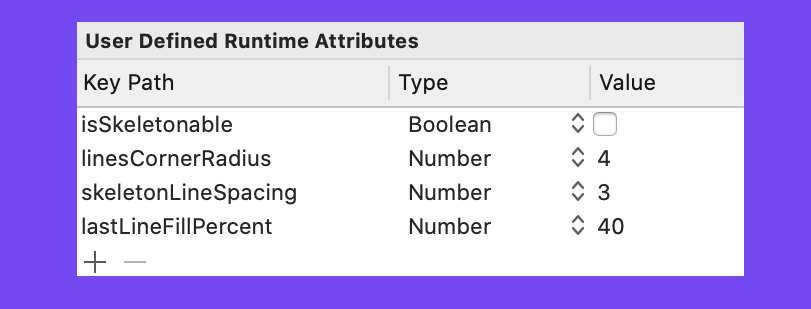

<p align="center">
    <a href="#-features">Features</a>
  • <a href="#-update">Update</a>
  • <a href="#-install">Installation</a>
  • <a href="#-architecture">Architecture</a>
  • <a href="#-usage">Usage</a>
  • <a href="#-miscellaneous">Miscellaneous</a>

</p>

Skeleton screens, when used to indicate that a screen is loading, are perceived to be of a shorter duration compared to other loading animations. **Skeleton Screens are focused on the indicator and not the progress**.
Skeleton displays that take advantage of slow, steady movements that move left to right are seen as shorter.
Apple's native skeleton loader already exists in the SkeletonUI framework, but it can only be used in conjunction with the SwiftUI and Combine frameworks.

**This Framework has been cloned from SkeletonView [☠️](https://github.com/Juanpe/SkeletonView)** and ported for use in ObjC as well as Swift View Controls in the Marriott environment .


## 
- [🌟 Features](#-features)
- [✔️ Update](#-update)
- [📟 Code](#-code)
- [📲 Install](#-install)
- [🏛️ Architecture](#-architecture)
- [🐒 Usage](#-usage)
    - [🔠 Texts](#-texts)
    - [🌿 Collections](#-collections)
- [✨ Miscellaneous](#-miscellaneous)

## 🌟 Features

* Usable from Objective-C and Swift
* All skeleton related settings could be defined from Interface Builder
* Usable in existing screens with minimal modifications
* Customizable colors and gradient animations
* Universal (iPhone and iPad)
* Lightweight readable code base

## ✔️ Update

It was decided to use the binary framework in order to integrate the Skeleton library into the Marriott project.
The original source was cloned from here [☠️] (https://github.com/Juanpe/SkeletonView), with the history preserved, then the Marriott-related changes were applied.

1️⃣ If you want to update the Skeleteon code with the original: clone / pull the code from this repository.

2️⃣ Add the original skeleton remote from the repo: git remote add original-skeleton-repo https://github.com/Juanpe/SkeletonView.git

3️⃣ Pull from original remote: git pull original-skeleton-repo

## 📟 Code

1️⃣ If you want to modify the Skeleteon code with your customizations: you can view and test your modifications with SkeletonDemo.xcodeproj in skeleton_ios, then commit and push to the origin.

## 📲 Install

1️⃣ clone / pull the code from this repository to the same folder where the ios folder is located.

2️⃣ cd skeleton_ios

3️⃣ launch the skeleton framework builder: ../ios/Tools/build_skeleton.sh
    This script will build and combine binaries for Simulator and iPhone in one framework,
    it will also copy the newly compiled framework to ios/Marriott/Marriott/Third-Party/Skeleton /
    
4️⃣ commit the modified Skeleton binaries in Marriott: 
    cd ios/
    git add /Marriott/Marriott/Third-Party/Skeleton/*
    git commit -m "Updated Skeleton Framework"

## 🏛️ Architecture

### 📑 Skeleton views layout

Here is an illustration that shows how you should specify which elements are skeletonables when you are using an UITableView:


As you can see, ```Skeleton``` is selective, so if you don't want to show skeleton in all subviews, then don't mark them. The skeleton layer will then not overlay unspecified subviews and they will be rendered as usual.

### 📃 Hierarchy

Since ```Skeleton``` is recursive, it will stop looking for ```skeletonable``` subviews as soon as a view is not ```skeletonable```. 
In other words if the parent of the view you want to skeltonize is not flagged ```skeletonable``` then ```Skeleton``` will never render it.

We expect to skeltonize avatarImage and textView but forgot to flag the parent view, then nothing is skeltonized
<kbd></kbd><kbd></kbd>


Finally the expected result

<kbd></kbd><kbd></kbd>


The cell container view is marked, but not the subviews

<kbd></kbd><kbd></kbd>


Everything is marked as skeletonizable

<kbd></kbd><kbd></kbd>

## 🐒 Usage

**Marriott integration example is in `MRTPropertySearchResultsListViewController`** and **`FlexibleDatesCell.swift`** in this PR [☠️](https://git.marriott.com/mobile/ios/pull/5231)

`Skeleton` module is alredy included in Marriott-Prefix.pch and Marriott-Bridging-Header.h, so no inclusions are necessary to use it.

### 🔠 Texts


When using elements with text, ```SkeletonView``` draws lines to simulate text.
Besides, you can decide how many lines you want. If  ```numberOfLines``` is set to zero, it will calculate how many lines needed to populate the whole skeleton and it will be drawn. Instead, if you set it to one, two or any number greater than zero, it will only draw this number of lines. 
📣 **IMPORTANT!** Do not leave the text field empty, otherwise the skeleton will not appear.

To specify skeleton related properies using storyboard:



Or, if you prefer **using code**, set the properties:
 
```swift
labelOrTextFileld.text = "      "// Do not leave the text field empty
labelOrTextFileld.isSkeletonable = true
labelOrTextFileld.linesCornerRadius = 5
labelOrTextFileld.skeletonLineSpacing = 6
labelOrTextFileld.lastLineFillPercent = 50
```

`linesCornerRadius` & `lastLineFillPercent` for multilines elements:

| Property | Values | Default | Preview
| ------- | ------- |------- | -------
| **Filling percent** of the last line. | `0...100` | `70%` | 
| **Corner radius** of lines. | `0...10` | `0` | 

Use `skeletonLineSpacing` to specify the gaps between skelton lines, if needed.

### 🖼️ Images

Pretty much the same as for the text field or label except there are no line related fields.

### 🌿 Collections

```SkeletonView``` is compatible with ```UITableView``` and ```UICollectionView```.

Pls see `MRTPropertySearchResultsListViewController` for **SkeletonCollectionDataSource** implementation,
`MRTSearchResultsFlow.storyboard` & `MRTPropertySearchResultListCell.xib` for **Skeleton IBInspectables** & 
in this PR [☠️](https://git.marriott.com/mobile/ios/pull/5231)

**UITableView**

If you want to show the skeleton in a ```UITableView```, you need to conform to ```SkeletonTableViewDataSource``` protocol.

``` swift
public protocol SkeletonTableViewDataSource: UITableViewDataSource {
    func numSections(in collectionSkeletonView: UITableView) -> Int
    func collectionSkeletonView(_ skeletonView: UITableView, numberOfRowsInSection section: Int) -> Int
    func collectionSkeletonView(_ skeletonView: UITableView, cellIdentifierForRowAt indexPath: IndexPath) -> ReusableCellIdentifier
}
```
As you can see, this protocol inherits from ```UITableViewDataSource```, so you can replace this protocol with the skeleton protocol.

This protocol has a default implementation:

``` swift
func numSections(in collectionSkeletonView: UITableView) -> Int
// Default: 1
```

``` swift
func collectionSkeletonView(_ skeletonView: UITableView, numberOfRowsInSection section: Int) -> Int
// Default:
// It calculates how many cells need to populate whole tableview
```

There is only one method you need to implement to let Skeleton know the cell identifier. This method doesn't have default implementation:
 ``` swift
 func collectionSkeletonView(_ skeletonView: UITableView, cellIdentifierForRowAt indexPath: IndexPath) -> ReusableCellIdentifier
 ```

**Example**
 ``` swift
 func collectionSkeletonView(_ skeletonView: UITableView, cellIdentifierForRowAt indexPath: IndexPath) -> ReusableCellIdentifier {
    return "CellIdentifier"
}
 ```
 
Besides, you can skeletonize both the headers and footers. You need to conform to `SkeletonTableViewDelegate` protocol.

```swift
public protocol SkeletonTableViewDelegate: UITableViewDelegate {
    func collectionSkeletonView(_ skeletonView: UITableView, identifierForHeaderInSection section: Int) -> ReusableHeaderFooterIdentifier? // default: nil
    func collectionSkeletonView(_ skeletonView: UITableView, identifierForFooterInSection section: Int) -> ReusableHeaderFooterIdentifier? // default: nil
}
```

**UICollectionView**

For `UICollectionView`, you need to conform to `SkeletonCollectionViewDataSource` protocol.

``` swift
public protocol SkeletonCollectionViewDataSource: UICollectionViewDataSource {
    func numSections(in collectionSkeletonView: UICollectionView) -> Int // default: 1
    func collectionSkeletonView(_ skeletonView: UICollectionView, numberOfItemsInSection section: Int) -> Int
    func collectionSkeletonView(_ skeletonView: UICollectionView, cellIdentifierForItemAt indexPath: IndexPath) -> ReusableCellIdentifier
    func collectionSkeletonView(_ skeletonView: UICollectionView, supplementaryViewIdentifierOfKind: String, at indexPath: IndexPath) -> ReusableCellIdentifier? // default: nil
}
```

The rest of the process is the same as ```UITableView```

> 📣 **IMPORTANT!** 
> 
> 1️⃣ If you are using resizable cells (**`tableView.rowHeight = UITableViewAutomaticDimension`**), it's mandatory define the **`estimatedRowHeight`**.
> 
> 2️⃣ When you add elements in a **`UITableViewCell`** you should add it to **`contentView`** and not to the cell directly.
> ```swift
> self.contentView.addSubview(titleLabel) ✅         
> self.addSubview(titleLabel) ❌
> ```

3️⃣ Once you've set the views, you can show the **skeleton**. To do so, you have **4** choices:

```swift
(1) view.showSkeleton()                 // Solid
(2) view.showGradientSkeleton()         // Gradient
(3) view.showAnimatedSkeleton()         // Solid animated
(4) view.showAnimatedGradientSkeleton() // Gradient animated
```

4️⃣ To hide **skeleton** and return to normal view:

```swift
rateLabel.hideSkeleton()
```
```obj-c
[self.collectionView hideSkeletonWithReloadDataAfter:YES transition:[[SkeletonTransitionStyle alloc] init:0] ];
```

## ✨ Miscellaneous 

**Supported OS & SDK Versions**

* from iOS 9.0
* Swift 5


